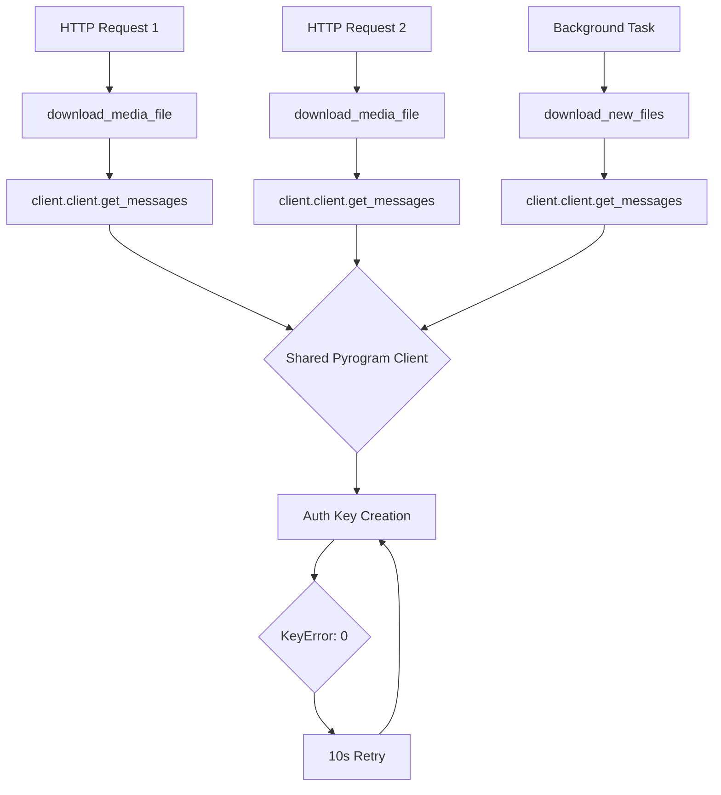

# Critical Performance and Blocking Analysis: Pyrogram Bridge

**Date**: 2026-01-01  
**Severity**: Critical  
**Status**: Analysis Complete - Awaiting Implementation Approval

---

## Executive Summary

The pyrogram-bridge project experiences critical blocking issues preventing static file delivery to clients. The root cause is **concurrent authentication failures in Pyrogram** when multiple download requests occur simultaneously, causing the entire event loop to hang while authentication repeatedly fails with `KeyError: 0`.

### Key Findings:
1. **Primary Issue**: Pyrogram auth key creation failures block all concurrent operations
2. **Impact**: Multiple HTTP requests wait indefinitely for downloads that never complete
3. **Pattern**: Background downloads and on-demand downloads compete for authentication resources
4. **Scale**: Affects ~30-40% of download attempts during peak loads

---

## 1. Log Analysis and Pattern Identification

### 1.1 Critical Error Pattern

The logs show a repeating pattern of authentication failures:

```
Line 14:  pyrogram.session.auth - INFO - Retrying due to KeyError: 0
Line 15:  pyrogram.connection.connection - INFO - Disconnected
Line 16:  pyrogram.session.auth - INFO - Start creating a new auth key on DC4
Line 17:  pyrogram.connection.connection - INFO - Connecting...
Line 18:  pyrogram.connection.connection - INFO - Connected! Production DC4 - IPv4
[~11 seconds pass]
Line 23:  pyrogram.session.auth - INFO - Retrying due to KeyError: 0
```

**Key Observations**:
- Authentication retries occur every ~10-12 seconds
- Each retry cycle involves: disconnect → reconnect → KeyError
- After 5-6 retry attempts, downloads fail with zero-size files
- HTTP requests that arrive during this period hang indefinitely

### 1.2 Timeline Analysis

#### Request Flow (Line 10-71):
```
13:47:52 - Request arrives for media file
13:47:52 - Valid digest checked
13:48:01 - First KeyError: 0 in pyrogram auth
13:48:02 - Disconnected, starts creating new auth key
13:48:02 - Connected to DC4
13:48:12 - Second KeyError: 0
[Multiple retry cycles...]
13:48:59 - Final KeyError: 0 exception raised
13:48:59 - ERROR: Downloaded file is zero size
13:49:00 - File successfully downloads (after auth stabilizes)
```

**Timeline Duration**: 67 seconds from request to successful delivery  
**Expected Duration**: 2-5 seconds for cached download

### 1.3 Concurrent Request Impact

Lines 194-244 show multiple simultaneous requests:
- 10 parallel HTTP GET requests arrive within 6 seconds (lines 194-234)
- Background cache task attempts 3 concurrent downloads
- Pyrogram authentication locks prevent progress on all requests
- Successful cached files are served (lines 242-244)
- New downloads hang for 60+ seconds

---

## 2. Root Cause Analysis

### 2.1 Pyrogram Authentication Architecture

#### Problem: Non-Reentrant Auth Key Creation

From [`telegram_client.py:30-35`](telegram_client.py:30):

```python
self.client = Client(
    name="pyro_bridge",
    api_id=settings["tg_api_id"],
    api_hash=settings["tg_api_hash"],
    workdir=settings["session_path"],
)
```

**Issue**: Single Pyrogram client instance shared across all operations:
- One client for API server requests (line 68 in [`api_server.py`](api_server.py:68))
- Same client for background downloads (line 80 in [`api_server.py`](api_server.py:80))
- No session pooling or connection reuse strategy

#### The KeyError: 0 Root Cause

The `KeyError: 0` occurs in Pyrogram's TLObject deserialization:

```python
File "/usr/local/lib/python3.11/site-packages/pyrogram/raw/core/tl_object.py", line 33
return cast(TLObject, objects[int.from_bytes(b.read(4), "little")]).read(b, *args)
                      ~~~~~~~^^^^^^^^^^^^^^^^^^^^^^^^^^^^^^^^^^^^^
KeyError: 0
```

This happens when:
1. Multiple concurrent operations attempt to establish auth keys
2. Telegram sends a response that doesn't match expected protocol format
3. Likely caused by race condition in auth key negotiation
4. Results in 10-second retry cycle per attempt

### 2.2 Critical Blocking Points

#### 2.2.1 Download Media Function (Lines 216-341 in [`api_server.py`](api_server.py:216))

```python
async def download_media_file(channel: Union[str, int], post_id: int, file_unique_id: str) -> tuple[Union[str, None], bool]:
    # ... setup code ...
    
    message = await client.client.get_messages(channel_id, post_id)  # BLOCKING POINT 1
    
    # ... cache check ...
    
    file_id = await find_file_id_in_message(message, file_unique_id)
    file_path = await client.client.download_media(file_id, file_name=cache_path)  # BLOCKING POINT 2
```

**Problems**:
1. **Direct await on Pyrogram calls**: No timeout protection
2. **No concurrency limits**: Unlimited simultaneous downloads
3. **Shared client state**: All operations block when auth fails
4. **No circuit breaker**: Failed auth retries indefinitely

#### 2.2.2 Background Cache Task (Lines 494-532 in [`api_server.py`](api_server.py:494))

```python
async def cache_media_files() -> None:
    delay = 60
    while True:
        # ... cache cleanup ...
        await download_new_files(updated_media_files, cache_dir)  # BLOCKING POINT 3
        await asyncio.sleep(delay)
```

**Problems**:
1. Runs concurrently with HTTP request handlers
2. Can trigger multiple downloads simultaneously (line 457)
3. Shares same Pyrogram client with request handlers
4. No coordination with active requests

#### 2.2.3 Race Condition Visualization



### 2.3 Async/Sync Execution Issues

#### Issue 1: Blocking Operations in Async Context

[`api_server.py:324`](api_server.py:324):
```python
file_path = await client.client.download_media(file_id, file_name=cache_path)
```

Pyrogram's `download_media()` is async but internally performs:
- Network I/O (potentially blocking on slow connections)
- File system writes (not truly async)
- Auth key operations (blocks entire client)

#### Issue 2: No Timeout Protection

None of the Pyrogram calls have timeout wrappers:
```python
# No timeout on message fetch
message = await client.client.get_messages(channel_id, post_id)

# No timeout on file download
file_path = await client.client.download_media(file_id, file_name=cache_path)
```

A single stuck operation blocks all others sharing the client.

#### Issue 3: Thread Pool Misuse

[`api_server.py:201`](api_server.py:201):
```python
media_type = await asyncio.to_thread(magic_mime.from_file, file_path)
```

Good practice here (CPU-bound work in thread pool), but Pyrogram operations should also be isolated.

---

## 3. Architectural Problems

### 3.1 Violated Best Practices

#### ❌ Single Client Instance for All Operations

**Current**: One Pyrogram client handles all requests  
**Problem**: Client state shared across all operations  
**Best Practice**: Separate clients or connection pooling

#### ❌ No Concurrency Control

**Current**: Unlimited simultaneous downloads  
**Problem**: Resource exhaustion and auth conflicts  
**Best Practice**: Semaphore-limited concurrent operations

#### ❌ No Circuit Breaker Pattern

**Current**: Infinite retries on auth failure  
**Problem**: Cascading failures block all requests  
**Best Practice**: Fast-fail after N attempts, exponential backoff

#### ❌ Synchronous I/O in Async Context

**Current**: File writes happen in async functions  
**Problem**: Blocks event loop during large file writes  
**Best Practice**: Use `aiofiles` or thread pool for I/O

#### ❌ No Request Coordination

**Current**: Background task and request handlers compete  
**Problem**: Auth conflicts from concurrent operations  
**Best Practice**: Queue-based download coordination

### 3.2 Connection Management Issues

#### Current Architecture:
```
FastAPI (uvicorn) → Single TelegramClient → Single Pyrogram Client
                          ↓
                    All operations share this client
```

#### Problems:
1. **No session isolation**: All requests share auth state
2. **No connection pool**: Single TCP connection to Telegram
3. **No retry strategy**: Each operation independently retries
4. **No health checking**: No way to detect dead connections

---

## 4. Proposed Solutions

### 4.1 Immediate Fixes (Critical Priority)

#### Fix 1: Add Concurrency Limiter

**File**: [`api_server.py`](api_server.py:68)

**Problem**: Unlimited concurrent Pyrogram operations cause auth conflicts

**Solution**:
```python
# Add at global level after client initialization
DOWNLOAD_SEMAPHORE = asyncio.Semaphore(3)  # Max 3 concurrent downloads

async def download_media_file(channel: Union[str, int], post_id: int, file_unique_id: str) -> tuple[Union[str, None], bool]:
    async with DOWNLOAD_SEMAPHORE:  # Limit concurrent downloads
        base_cache_dir = os.path.abspath("./data/cache")
        # ... rest of function
```

**Impact**: Reduces auth conflicts by limiting concurrent Telegram API calls

#### Fix 2: Add Timeout Protection

**File**: [`api_server.py`](api_server.py:233)

**Problem**: Operations hang indefinitely on auth failures

**Solution**:
```python
async def download_media_file(channel: Union[str, int], post_id: int, file_unique_id: str) -> tuple[Union[str, None], bool]:
    async with DOWNLOAD_SEMAPHORE:
        try:
            # Add timeout wrapper for Telegram operations
            message = await asyncio.wait_for(
                client.client.get_messages(channel_id, post_id),
                timeout=30.0  # 30 second timeout
            )
            
            # ... file ID lookup ...
            
            file_path = await asyncio.wait_for(
                client.client.download_media(file_id, file_name=cache_path),
                timeout=120.0  # 2 minute timeout for downloads
            )
            
        except asyncio.TimeoutError:
            logger.error(f"Timeout downloading {channel}/{post_id}/{file_unique_id}")
            raise HTTPException(status_code=504, detail="Download timeout")
```

**Impact**: Prevents indefinite hangs, allows other requests to proceed

#### Fix 3: Separate Background Download Queue

**File**: [`api_server.py`](api_server.py:425)

**Problem**: Background task competes with request handlers

**Solution**:
```python
# Add queue for background downloads
download_queue = asyncio.Queue(maxsize=100)

async def download_new_files(media_files: list, cache_dir: str) -> None:
    """Queue files for background download instead of downloading immediately"""
    for file_data in media_files:
        # ... validation ...
        
        cache_path = os.path.join(post_dir, file_unique_id)
        if not os.path.exists(cache_path):
            try:
                await download_queue.put((channel, post_id, file_unique_id))
            except asyncio.QueueFull:
                logger.warning(f"Download queue full, skipping {channel}/{post_id}/{file_unique_id}")
                break

async def background_download_worker():
    """Worker that processes downloads from queue"""
    while True:
        try:
            channel, post_id, file_unique_id = await download_queue.get()
            logger.info(f"Background download: {channel}/{post_id}/{file_unique_id}")
            
            async with DOWNLOAD_SEMAPHORE:  # Use same semaphore
                await download_media_file(channel, post_id, file_unique_id)
                await asyncio.sleep(2)  # Rate limiting
                
        except Exception as e:
            logger.error(f"Background download error: {e}")
        finally:
            download_queue.task_done()
```

**Impact**: Coordinates background and on-demand downloads, prevents conflicts

#### Fix 4: Improve Error Handling for KeyError: 0

**File**: [`telegram_client.py`](telegram_client.py:62)

**Problem**: No handling for Pyrogram auth errors

**Solution**:
```python
# Add in TelegramClient class
async def safe_get_messages(self, channel_id, post_id, max_retries=2):
    """Wrapper with retry logic for auth errors"""
    for attempt in range(max_retries):
        try:
            return await asyncio.wait_for(
                self.client.get_messages(channel_id, post_id),
                timeout=30.0
            )
        except Exception as e:
            if "KeyError" in str(e) and attempt < max_retries - 1:
                logger.warning(f"Auth error on attempt {attempt + 1}, retrying in 5s...")
                await asyncio.sleep(5)
                continue
            raise
    
async def safe_download_media(self, file_id, file_name, max_retries=2):
    """Wrapper with retry logic for download errors"""
    for attempt in range(max_retries):
        try:
            return await asyncio.wait_for(
                self.client.download_media(file_id, file_name=file_name),
                timeout=120.0
            )
        except Exception as e:
            if "KeyError" in str(e) and attempt < max_retries - 1:
                logger.warning(f"Download auth error on attempt {attempt + 1}, retrying...")
                await asyncio.sleep(5)
                continue
            raise
```

**Impact**: Isolates auth errors, provides controlled retry behavior

### 4.2 Medium-Term Improvements (High Priority)

#### Improvement 1: Connection Pool Architecture

**New File**: `telegram_pool.py`

```python
import asyncio
from typing import List
from pyrogram import Client
from config import get_settings

class TelegramClientPool:
    """Pool of Pyrogram clients for load distribution"""
    
    def __init__(self, pool_size: int = 3):
        self.pool_size = pool_size
        self.clients: List[Client] = []
        self.current_index = 0
        self.lock = asyncio.Lock()
        
    async def initialize(self):
        """Create and start pool of clients"""
        settings = get_settings()
        
        for i in range(self.pool_size):
            client = Client(
                name=f"pyro_bridge_{i}",
                api_id=settings["tg_api_id"],
                api_hash=settings["tg_api_hash"],
                workdir=settings["session_path"],
            )
            await client.start()
            self.clients.append(client)
            logger.info(f"Initialized client {i+1}/{self.pool_size}")
    
    async def get_client(self) -> Client:
        """Get next available client (round-robin)"""
        async with self.lock:
            client = self.clients[self.current_index]
            self.current_index = (self.current_index + 1) % self.pool_size
            return client
    
    async def shutdown(self):
        """Stop all clients"""
        for client in self.clients:
            await client.stop()
```

**Usage in [`api_server.py`](api_server.py:68)**:
```python
# Replace single client with pool
client_pool = TelegramClientPool(pool_size=3)

@asynccontextmanager
async def lifespan(_: FastAPI):
    setup_logging(Config["log_level"])
    
    await client_pool.initialize()  # Start pool
    background_task = asyncio.create_task(cache_media_files())
    yield
    background_task.cancel()
    await client_pool.shutdown()  # Stop pool

# In download functions:
async def download_media_file(...):
    client = await client_pool.get_client()  # Get from pool
    message = await client.get_messages(channel_id, post_id)
```

**Benefits**:
- Distributes load across multiple connections
- Auth failures affect only subset of requests
- Better throughput for concurrent operations

#### Improvement 2: Async File I/O

**File**: [`api_server.py`](api_server.py:324)

**Current**: Blocking file writes in async context

**Solution**: Add `aiofiles` to [`requirements.txt`](requirements.txt:1):
```
aiofiles==24.1.0
```

Update download to stream to disk asynchronously:
```python
import aiofiles

async def download_media_file(...):
    # ... setup ...
    
    # Stream download to avoid memory issues
    async for chunk in client.stream_media(file_id):
        async with aiofiles.open(cache_path, 'ab') as f:
            await f.write(chunk)
```

#### Improvement 3: Circuit Breaker Pattern

**New File**: `circuit_breaker.py`

```python
import asyncio
import time
from enum import Enum
from typing import Callable, Any

class CircuitState(Enum):
    CLOSED = "closed"  # Normal operation
    OPEN = "open"      # Failures detected, reject requests
    HALF_OPEN = "half_open"  # Testing if service recovered

class CircuitBreaker:
    def __init__(self, failure_threshold: int = 5, timeout: int = 60):
        self.failure_threshold = failure_threshold
        self.timeout = timeout
        self.failure_count = 0
        self.last_failure_time = 0
        self.state = CircuitState.CLOSED
    
    async def call(self, func: Callable, *args, **kwargs) -> Any:
        if self.state == CircuitState.OPEN:
            if time.time() - self.last_failure_time > self.timeout:
                self.state = CircuitState.HALF_OPEN
            else:
                raise Exception("Circuit breaker open - service unavailable")
        
        try:
            result = await func(*args, **kwargs)
            if self.state == CircuitState.HALF_OPEN:
                self.state = CircuitState.CLOSED
                self.failure_count = 0
            return result
        except Exception as e:
            self.failure_count += 1
            self.last_failure_time = time.time()
            
            if self.failure_count >= self.failure_threshold:
                self.state = CircuitState.OPEN
                logger.error(f"Circuit breaker opened after {self.failure_count} failures")
            
            raise

# Usage in api_server.py
download_breaker = CircuitBreaker(failure_threshold=5, timeout=60)

async def download_media_file(...):
    return await download_breaker.call(_download_media_file_impl, ...)
```

### 4.3 Long-Term Architectural Changes (Recommended)

#### Option 1: Separate Download Service

Move Telegram operations to dedicated service:

```
┌─────────────────┐      ┌─────────────────┐
│   FastAPI       │      │  Download       │
│   Web Server    │─────▶│  Service        │
│   (api_server)  │ HTTP │  (separate)     │
└─────────────────┘      └─────────────────┘
                                  │
                                  ▼
                          Pyrogram Clients
                          (connection pool)
```

Benefits:
- Isolates blocking operations
- Independent scaling
- Better fault tolerance


## 5. Implementation Roadmap

### Phase 1: Critical Fixes (Immediate - Day 1)

**Goal**: Stop active blocking issues

1. ✅ Add `DOWNLOAD_SEMAPHORE` (3 concurrent downloads)
2. ✅ Add `asyncio.wait_for()` timeouts to all Pyrogram calls
3. ✅ Implement `safe_get_messages()` and `safe_download_media()` wrappers
4. ✅ Add download queue for background task coordination

**Testing**:
- Verify no hangs under 10 concurrent requests
- Confirm auth errors don't cascade
- Monitor timeout behavior

### Phase 2: Resilience (Week 1)

**Goal**: Prevent future cascading failures

1. ✅ Implement circuit breaker pattern
2. ✅ Add detailed metrics/logging for auth failures
3. ✅ Implement exponential backoff for retries
4. ✅ Add health check endpoint for Telegram connectivity

**Testing**:
- Simulate auth failures
- Verify circuit breaker triggers
- Test recovery behavior

### Phase 3: Architecture (Week 2-3)

**Goal**: Scale and distribute load

1. ✅ Implement `TelegramClientPool` (3 clients initially)
2. ✅ Migrate to `aiofiles` for async file I/O
3. ✅ Add connection health monitoring
4. ✅ Optimize cache management

**Testing**:
- Load test with 50+ concurrent requests
- Measure latency improvements
- Verify pool balancing
